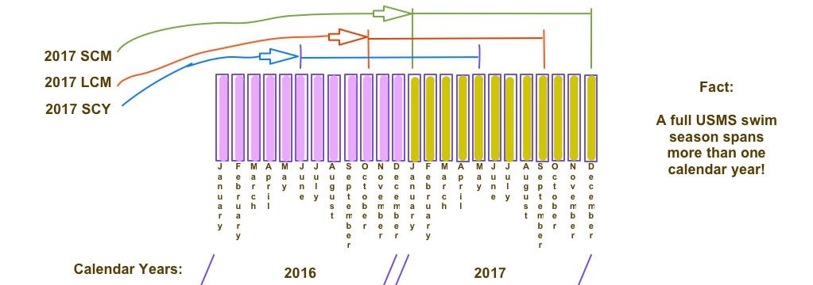

# PMSTopTen Internal Documentation
<h5 style="text-align: center">30May2018 - Bob Upshaw</h5>

TBD:  
2. GeneratedFiles is in Historical but not in the root.  
3. Add a section specifically for GeneratedFiles and link to it in Historical.  
4. Same for SourceData.  (need to clean up Historical)
5. Same for SourceData-2018  (need to clean up Historical)
6. Same for Support  
8. link to rules in overview
9. change permissions of checked-in properties_DB.txt to be go-rwx
10. document the cron job; scripts used, including push (dev/prod dependent)
13. describe maintenance tasks and the maintenance group
14. Add the license

### Overview
This document contains the details of how to support and run the PMSTopTen project to generate the AGSOTY (Age Group Swimmer Of The Year) page for Pacific Masters (or any other group that wants to do the same thing.)  

This project is comprised of 3 main Perl programs which are used to fetch and process swimmer results for a specific AGSOTY <a href="#seasons">season</a>.  These results are "scraped" from two different web sites:  usms.org and pacificmasters.org.  Both of these web sites are used by their respective organizations to publish the individual swimming results of its members.  It is these results that we analyze to compute the top swimmers in our LMSC.  All swimmers who compete in USMS sanctioned (or approved) events and who earn points (see the AGSOTY rules [[[need link]]]) are included in this analysis and are part of the AGSOTY page.

Here is a high-level view of the data and control flow during the generation of an AGSOTY page.

In order to generate an AGSOTY page you need to fetch the PMSTopTen project files, configure the property files, and then execute the contained programs. 

#### Documentation Conventions
This document will often list steps to perform in the form of Unix shell commands.  A shell command begins with a '%'.  Meta terms are surrounded by <>.  For example:  
% cd \<rootDir\>  
which means "change directory to the directory known as the 'rootDir'".

### Glossary
1. AGSOTY : Age Group Swimmer of the Year.  Recognition awarded to one male and one female Pacific Masters swimmer.  Recently renamed "LVSOTY" (Laura Val Swimmer of the Year) but since AGSOTY has been used for years and it shows up in the code we use these two terms interchangeably. 
3. LVSOTY : See "AGSOTY" above.
4. LVSOTY Committee : a group formed within Pacific Masters to choose the male and female Swimmer of the Year for every AGSOTY season.  The male and female recipients of this award are determined largely, but not solely, on the basis of their earned AGSOTY points.
5. AGSOTY files : the files generated by the PMSTopTen project.  The most important file is an HTML file ("index.html") 
1.  appRootDir : the root of the tree holding all the files in a local repository tree (e.g. the PMSTopTen project tree.)
2. rootDir : the parent directory of the appRootDir.
3. yearToProcess : the AGSOTY <a href="#seasons">season</a> being processed by the PMSTopTen project.  "year" in the name is a misnomer, since a full AGSOTY <a href="#seasons">season</a> encompasses 18 calendar months. See <a href="#seasons">"What is a Season?"</a> below.

### PMSTopTen Project Files
The code and support files for the PMSTopTen project are stored in a GitHub repository here:
[https://github.com/bobup/PMSTopTen](https://github.com/bobup/PMSTopTen)  
In addition, this project uses a shared library of Perl modules stored in this GitHub repository: 
[https://github.com/bobup/PMSPerlModules](https://github.com/bobup/PMSPerlModules)  
General purposes Perl modules are used and are available from CPAN.

To build and use the PMSTopTen project you'll need to create TWO local repositories:  one for PMSTopTen and the other for PMSPerlModules.  Details follow:
##### PMSPerlModules
To create the PMSPerlModules local repository execute the following commands:  
1. `% cd <rootDir>`  
2. `% git clone https://github.com/bobup/PMSPerlModules`

##### Files that make up PMSPerlModules
When you create the local repository for the PMSPerlModules project you'll have a tree with the root being named 'PMSPerlModules' located in your "rootDir".  This is known as the "appRootDir" in the documentation.  Here is what makes up the appRootDir of the PMSPerlModules project when cloned from the GitHub repository:

PMSPerlModules/

* History_MySqlSupport.pm - (Not used by PMSTopTen.  Used by PMSOWPoints only.)
* PMSConstants.pm - Contains some global constants.
* PMSLogging.pm  - Supports logging to files and the console.
* PMSMacros.pm - Macro support for template processing and code.
* PMSProcess2SingleFile.pm - (Not used by PMSTopTen.  Used by PMSOWPoints only.)
* PMSStoreSingleRow.pm - (Not used by PMSTopTen.  Used by PMSOWPoints only.)
* PMSStruct.pm - Contains more complex data structures.
* PMSUtil.pm - Generally purpose utility routines.
* PMS_ImportPMSData.pm - Read various support data files (<a href="rsidn">RSIDN</a>, etc.)
* PMS_MySqlSupport.pm  - MySql support routines.

##### PMSTopTen
To create the PMSTopTen local repository execute the following commands:  
1. `% cd <rootDir>`  
2. `% git clone https://github.com/bobup/PMSTopTen`

##### Files that make up PMSTopTen

When you create the local repository for the PMSTopTen project you'll have a tree with the root being named 'PMSTopTen' located in your "rootDir".  This is known as the "appRootDir" in the documentation.  Here is what makes up the appRootDir of the PMSTopTen project when cloned from the GitHub repository:

PMSTopTen/

* Code/  - Contains Perl code, HTML templates, bash scripts, etc.
 * GetResults.pl  - The program used to fetch the raw data processed by PMSTopTen in order to create the top ten html file (and other output.)
 * Topten2.pl  - The program used to analyze the data files fetched by GetResults.pl and generate the top ten html file (and other output.)
 * TTStats.pl  - The program used to generate some statistics about the top ten analysis performed by Topten2.pl.  <a href="#TTStats">Details below</a>
 * Scripts/  - useful bash scripts.  Used on both Mac and Linux.
     * DoFetchAndProcessTopten  - Executes GetResults.pl and then, if necessary, Topten2.pl.
     * FetchTopten  - Executes GetResults.pl
     * GenTopten2  - Executes Topten2.pl
     * cmpcsv.sh  - Used to compare two csv files.  Currently only useful on a Mac, where line termination is a problem.
     * PMSScripts/  - Useful PMS-specific scripts.  These scripts are "PMS specific" because they depend on the exact layout of the PMS web servers.
         * PushTT2Dev.bash  - Push the latest generated Top Ten files to the dev web server (if such files exist.)
         * PushTT2Prod.bash  - Push the latest generated Top Ten files on the dev web server to the production web server IF the files look "sane".
         * PushTT.bash  - Push the latest generated Top Ten files to the dev web server, and if successful, push to the production web server.  The caveats for PushTT2Dev.bash and PushTT.bash apply.

         
 * TTPerlModules/ - A directory containing Perl libraries used by this project.
     * TT_Logging.pm  - Logging support routines.
     * TT_MySqlSupport.pm  - MySql support routines.
     * TT_SheetSupport.pm  - Excel support routines.
     * TT_Struct.pm  - Data structure support routines.
     * TT_Template.pm  - Template processing support routines.
     * TT_USMSDirectory.pm  - Support caching USMS data.
     * TT_Util.pm  - Various utility support routines.

 * Templates/  - a collection of small HTML files that contain macros and are used by Topten2.pl to create the resultant HTML file.
     * AGSOTY-StartHead.html, etc.  - Various template files used in the generation of the top ten HTML file.
     * Stats/  - Contains a template file used to generate HTML-formatted statistics about the top ten results.
         * TTStatsTemplate.txt  - Statistics template file.  <a href="#TTStats">See TTStats details below</a>

 * properties.txt  - properties that control the above Perl programs and also supply some values for the macros referenced in the templates.
* Historical/  - Contains historical data (data for previous years)
    * 2016/ - Contains all the data necessary to generate the 2016 top ten final results, along with the final generated files.
        * GeneratedFiles-2016/  - Contains the final generated files.  <a href="#GeneratedFiles">Details below</a>.
        * SourceData-2016/  - Contains the data necessary to create the generated files.  <a href="#SourceData">Details below</a>.

    * 2017/ - Same as for 2016/ with appropriate subdirectory name changes.
    * (Other years will be added when completed.)

* LICENSE.txt  - The software license covering this repository.
* README.md  - A brief description of this project.
* SeasonData/  - The data used to generate the top ten page for the current AGSOTY <a href="#seasons">season</a>.
    * Season-2018/  - This assumes that the current AGSOTY <a href="#seasons">season</a> is 2018.  This directory contains all the data used to generate top ten results for this <a href="#seasons">season</a>.
        * PMSSwimmerData/  - PMS swimmer-specific data, independent of results.  For example, <a href="rsidn">RSIDN</a> (aka RSIND) files, the most current of which represents the PMS membership database.
        * SourceData-2018/  - PMS results data which is processed to compute the top ten web page.  Contains files making up PMS top ten results for each course, USMS top ten for each course, records, open water results, etc. <a href="#SourceData2018">Details below</a>.
        * properties-2018.txt  - AGSOTY season-specific properties that control the above Perl programs and also supply some values for the macros referenced in the templates.  Properties in this file override properties defined in the properties.txt file described above.
* Support/  - Runtime support files.  <a href="#Support">Details below</a>
* doc/  - The directory holding this document and others.

### Configuration of the Local Repository
Once you've created the local repositories for the PMSPerlModules and the PMSTopTen projects you need to configure the PMSTopTen project.  Here is what needs to be done:

##### Make the <a href="#GeneratedFiles">GeneratedFiles</a> Directory
We need to make sure the directory into which all generated files are written exists:

1. `% cd <rootDir>/PMSTopTen`  
2. `% mkdir -p GeneratedFiles`

##### Configure the Database
Next you need to configure database access for the PMSTopTen project whose <appRootDir> is <rootDir>/PMSTopTen.  To do this you need to update a property file stored in <appRootDir>/Code named properties_DB.txt:

1. `% cd <appRootDir>/Code`
2. `% vi properties_DB.txt`
    3. Change the value of "dbHost" to be the host name of the server hosting the database server.  This will be "localhost" if the database server is running on the same server running this project.
    4. Set the value of "dbName" to the name of the name database being used by this project.
    5. Set the value of "dbUser" to the name of the database user used by this project.
    6. Set the value of "dbPass" to the to the dbUser's password that gives the user read/write access to all the tables of the dbName database.  Since this should be kept private DO NOT allow this file to be readable to world.  If necessary do this: 
4. `% chmod go-rwx properties_DB.txt`

##### PERL CPAN Libraries
The PMSTopTen project depends on a few public domain Perl libraries in order to support Excel reading and writing.  These are the CPAN libraries that were used during development:

* Excel-Writer-XLSX-0.96/ - [http://search.cpan.org/dist/Excel-Writer-XLSX/lib/Excel/Writer/XLSX.pm](http://search.cpan.org/dist/Excel-Writer-XLSX/lib/Excel/Writer/XLSX.pm)
* Spreadsheet-Read-0.75/ - [http://search.cpan.org/~hmbrand/Spreadsheet-Read/Read.pm](http://search.cpan.org/~hmbrand/Spreadsheet-Read/Read.pm)
* Spreadsheet-XLSX-0.15/ - [http://search.cpan.org/~dmow/Spreadsheet-XLSX-0.13-withoutworldwriteables/lib/Spreadsheet/XLSX.pm](http://search.cpan.org/~dmow/Spreadsheet-XLSX-0.13-withoutworldwriteables/lib/Spreadsheet/XLSX.pm)

You must guarantee that the Perl search path includes these libraries that you've downloaded and installed on the machine running this project.  The easiest way to do this is to set the environment variable "PERL5LIB" to the list of directories holding the above libraries.  For example, add this statement to your login initialization file:

`% export PERL5LIB=/home/cpan/Excel-Writer-XLSX-0.96/lib\`
 
`    :/home/cpan/Spreadsheet-Read-0.75\`
 
`    :/home/cpan/Spreadsheet-XLSX-0.15/lib`

Note that later versions may be available and should probably work just as well as the versions above.

### Run the PMSTopTen Project
Once we have the GeneratedFiles/ subdirectory, we've configured our database access, and we have set up our Perl search path we can fetch race results, analyze them, and generate the AGSOTY page.  There are a number of ways to do this, but the easiest way is to do this:

1. `% cd <appRootDir>/Code/Scripts`
2. `% ./DoFetchAndProcessTopten <yearToProcess>`

The bash script "DoFetchAndProcessTopten" will fetch various results to process, and, if those results are different from the last time we fetched results, it will process the results and generate the AGSOTY page.

The "DoFetchAndProcessTopten" script performs a lot of steps, but basically executes two scripts.  Here is how you can execute those scripts by hand:

1. `% cd <appRootDir>/Code/Scripts`
2. `% ./FetchTopten <yearToProcess>`
3. `# assuming the above did not get any errors we can now generate our AGSOTY page`
4. `% ./GenTopten2 <yearToProcess>`

At this point the generated AGSOTY page, Excel files, and log files have been written to <appRootDir>/GeneratedFiles/Generated-\<yearToProcess\> . These are simply known as the "Generated Files".

### Generated Files
The primary reason for the PMSTopTen project is to generate files representing various views of a specific AGSOTY season.  We make these files available to all PAC swimmers (well, actually, anyone can access them, but they are not very interesting unless you're a PAC competitor.)  Some files display the current standings as an HTML page, others display a subset of the standings for use by the LVSOTY Committee.  These files summarize all AGSOTY points earned by all (or a subset of) PAC competitive swimmers for a specific AGSOTY <a href="#seasons">season</a>.

 For example, here are the files generated during the 2018 AGSOTY <a href="#seasons">season</a>:

Generated-2018/

* index.html - The AGSOTY page.  Summarizes all points for all competitive PAC swimmers for the current <a href="#seasons">season</a>.
* HTMLVSupport-CAG/ - A directory holding more HTML results for each gender and age group.    <a href="#Vsupport">Details below</a>.
* TTStats.html - Statistics generated while generating the AGSOTY page.  <a href="#TTStats">Details below</a>
* cag.html - Special page describing the swimmers who change age groups during this AGSOTY <a href="#seasons">season</a>.
* GetResultsLog-2018.txt - Log file generated by GetResults.pl.
* TopTenLog-2018.txt - Log file generated by Topten2.pl.
* TTStatsLog-2018.txt - Log file generated by TTStats.pl.
* FullExcelResults-2018.xlsx - The AGSOTY page as an Excel file.
* TopSOTYContenders-2018.xlsx - A report on AGSOTY swimmers who are the top AGSOTY swimmers for the <a href="#seasons">season</a>.
* Top_3_ExcelResults-2018.xlsx - A report on the AGSOTY swimmers who are placed top 3 in their gender and age group.
* index.html.old - the previous version of index.html.
* Historical/  - this is either a symbolic link to 

### Historical/SourceData/
Each year covered in the Historical/ directory contains a SourceData/ subdirectory.  
(need to clean up the Historical tree) 

##### SourceData-2018/
The SourceData-\<yearToProcess>/ directory is used to hold the USMS and PAC results which we process in order to compute every swimmer's AGSOTY points.  These results are stored as files which are constructed by the GetResults.pl Perl program.  Here is a list of the files we construct and later process:

* \<yearToProcess\>PacMastersOWPlacesForEachSwimmer.csv - Open Water results.
* PACRecordsLCM-\<yearToProcess\>.csv - PAC LCM records.
* PACRecordsSCM-\<yearToProcess\>.csv - PAC SCM records.
* PACRecordsSCY-\<yearToProcess\>.csv - PAC SCY records.
* PACTop10LCM-\<yearToProcess\>.xlsx - PAC top 10 swimmers for each event, gender, and age group for LCM.
* PACTop10SCM-\<yearToProcess\>.xlsx - PAC top 10 swimmers for each event, gender, and age group for SCM.
* PACTop10SCY-\<yearToProcess\>.xlsx - PAC top 10 swimmers for each event, gender, and age group for SCY..xlsx
* USMSRecords-M-LCM-\<yearToProcess\>.csv - Men's USMS LCM records.  NOT LMSC specific.
* USMSRecords-M-SCM-\<yearToProcess\>.csv - Men's USMS SCM records.  NOT LMSC specific.
* USMSRecords-M-SCY-\<yearToProcess\>.csv - Men's USMS SCY records.  NOT LMSC specific.
* USMSRecords-W-LCM-\<yearToProcess\>.csv - Women's USMS LCM records.  NOT LMSC specific.
* USMSRecords-W-SCM-\<yearToProcess\>.csv - Women's USMS SCM records.  NOT LMSC specific.
* USMSRecords-W-SCY-\<yearToProcess\>.csv - Women's USMS SCY records.  NOT LMSC specific.
* USMSTop10LCM-\<yearToProcess\>.csv - USMS top 10 swimmers for each event, gender, and age group for LCM.  Specific to our LMSC.
* USMSTop10SCM-\<yearToProcess\>.csv - USMS top 10 swimmers for each event, gender, and age group for SCM.  Specific to our LMSC.
* USMSTop10SCY-\<yearToProcess\>.csv - USMS top 10 swimmers for each event, gender, and age group for SCY.  Specific to our LMSC.
* races.txt - a list of all meets seen while searching for results to be processed.  This information is used to supply drill-down data for individual swims.

Note:  not all files exists at all times.  For example, at the beginning of a AGSOTY <a href="#seasons">season</a> we won't have any files to process because no meets for the season have been swum.  After a few months there may be results for SCY only, thus no results for SCM and LCM will exist.

##### Support/
The Support/ subdirectory contains files accessed at runtime by the HTML files generated by this program.  These files are NOT generated by PMSTopTen, but instead are created and made available to the HTML code.  For example, there is at least one CSS include file, at least one javascript library, some .gif and .jpg files, etc.  Notice that PMSTopTen depends on jquery, and the jquery support files are actually installed in the Support/ directory.  This allows the generated HTML files to operate without internet access (useful during development), and also isolates PMSTopTen from changes to the jquery library that may break the AGSOTY HTML files.

It is a maintenance task to guarantee that an adequate version of all the Support/ files are available to the generated HTML files when they are pushed to production.  See <a href="#maintenanceTasks">"Maintenance Tasks"</a> below.

##### RSIDN
A "RSIDN" file ("Registered Swimmer IDentification Number") is a file that is used to allow PMSTopTen to identify a Pacific Masters swimmer, both by name and by USMS registration number (which contains the USMS Swimmer Id.)  Every USMS swimmer has a unique Swimmer Id.  However, not every USMS swimmer has a unique name.  This causes some problems when PMSTopTen finds a result identified only by the name of the swimmer, because we may not be able to guarantee that the swimmer is a registered PAC swimmer.  A review of the code will reveal how we handle such situations.

A RSIDN file contains the swimmer's name, USMS registration number, team, etc.

##### HTMLVSupport-CAG
A design decision make very early on was that PMSTopTen must be scalable to support Pacific Masters when it has 10,000 competitive swimmers.  If the AGSOTY HTML page was generated with information for all PAC competitive swimmers and there were 10,000 such swimmers the page would take minutes to load (using internet speeds typical in 2016.)  So to get around this, the AGSOTY HTML file (index.html - see above) contains information for only the top 10 swimmers in each gender and age group.  To view more swimmers in a specific gender/age group all one has to do is click on any one of the visible swimmers in that group, or click the "Click here to see the rest of the swimmers" link at the end of the group.  When the user performs either of those actions PMSTopTen will perform an Ajax operation to fetch the rest of the data for that gender/age group.  The "rest of the data" for every gender/age group is stored as individual files in the HTMLVSupport-CAG/ subdirectory of the GeneratedFiles/ directory.

### What is a Season?

When we use the term "season" we may need to qualify the term.  As we all know, USMS competes in three different size pools.  We call each size pool a specific "course".  The three courses USMS uses for competition are:

* Short Course Yards (SCY) - 25 yard length pools.
* Short Course Meters (SCM) - 25 meter length pools.
* Long Course Meters (LCM) - 50 meter length pools.

Each course has a different competitive season, and each of the seasons is 12 months in length.  An AGSOTY season is 19 months in length and encompasses a full season for each course.  This means that the seasons for each course partially overlap.  The seasons for each course are:

* June 1 through May 31 of the following year:  SCY
* October 1 through September 30 of the following year:  LCM
* January 1 through December 31 of the same year:  SCM

Here is a pictorial representation of a single AGSOTY season:

In the above example, the 2017 AGSOTY season begins on June 1st, 2016 and ends on December 31, 2017.  This definition of "seasons" clearly defines which swims for a specific course count towards which AGSOTY season.  For example:

> Points earned during a SCY swim on July 4th, 2016 apply towards the 2017 AGSOTY season, but points earned during a SCM swim on the same day apply towards the 2016 AGSOTY season.

For obvious reasons, every swim recorded by USMS must also include the exact course and date of the swim in order for us to compute AGSOTY points correctly.

### What is TTStats Anyway?
Above we describe a program named "TTStats.pl" which is "used to generate some statistics".  What does that mean?

When Topten2.pl executes it populates a MySql database with a few tables full of data describing every swimmer, event, and splash relevant to computing AGSOTY.  When finished the TTStats.pl program is invoked to use those data to create a simple text file (strictly speaking it's a HTML file but it uses almost no HTML formatting) that can be displayed if desired (see <a href="easter">"Easter Egg"</a> below.)  The data displayed are things like (not a complete list):

* Number of swimmers who swam in exactly one age group (with and without points) by gender
* Number of splashes per age group and gender
* Number of total points earned
* Number of Open Water splashes
* etc.

This information may be interesting for back-end analysis.

BUT, there is another more important purpose for these data.  Three datums are:

* Number of total points earned
* Number of Open Water splashes
* Number of swimmers who swam at least one Open Water event

All three are simple scalars, and are chosen to likely increase or stay constant as the AGSOTY season progresses.  This allows us to easily compare these three values generated during a specific generation of AGSOTY with their counterparts from the previous generation of AGSOTY and confirm that the later statistics are "sane".  For example:

* On Monday the FetchTopten script is executed, followed by the GenTopten2 script, which completes by executing TTStats.pl.  The result is:
    * The "Number of total points earned" is 10,209.
    * The "Number of Open Water splashes" is 523.
    * The "Number of swimmers who swam at least one Open Water event is 523.
* On Tuesday the same scripts are executed.  New results were found so the numbers change:
    * The "Number of total points earned" is 10,498.
    * The "Number of Open Water splashes" is 904.
    * The "Number of swimmers who swam at least one Open Water event is 655.

> The comparison of the statistics generated on Monday with those generated on Tuesday passes the internal sanity test, allowing PMSTopTen to push the AGSOTY files generated on Tuesday to production, overwriting those generated on Monday.  But consider this:

* On Wednesday the same scripts are executed.  New results were found and the numbers change again:
    * The "Number of total points earned" is 504.
    * The "Number of Open Water splashes" is 0.
    * The "Number of swimmers who swam at least one Open Water event is 0.

> The comparison of the statistics generated on Tuesday with those generated on Wednesday tell us that something is wrong.  As a result, the AGSOTY files generated on Wednesday are NOT pushed to production, and instead an email is sent to the maintenance group requiring human intervention before new AGSOTY files are pushed to production.  In all likelihood the maintenance group will review the log files, discover a problem, fix it, and re-run the scripts.

## Maintenance Tasks

## Our Easter Egg
In order to allow the maintenance group to easily analyze the results of PMSTopTen the generated AGSOTY HTML file has a hidden [easter egg](https://en.wikipedia.org/wiki/Easter_egg_(media)).  To view this easter egg perform the following steps:

1. Open index.html in a browser and then scroll down to the bottom of the file.  At the bottom is a Pacific Masters Swimming logo.  Clicking on the logo will send the user to the Pacific Masters Swimming web site, so don't bother clicking on it.  Instead...
2. Hold down two keys and click on the logo.  The two keys are:
  3. On a Mac:  shift-option
  4. On Windows:  shift-alt
5. The response will be a simple dialog asking "Show Details?".  Click "OK" to get your prize.

What you will then see is a display of the top overall swimmers (by points) and a list of all events analyzed to award points to PAC swimmers.  In addition, at the bottom of this new display is a button titled "Show Statistics".  Click that and you'll see the TTStats generated as a result of this AGSOTY generation. 