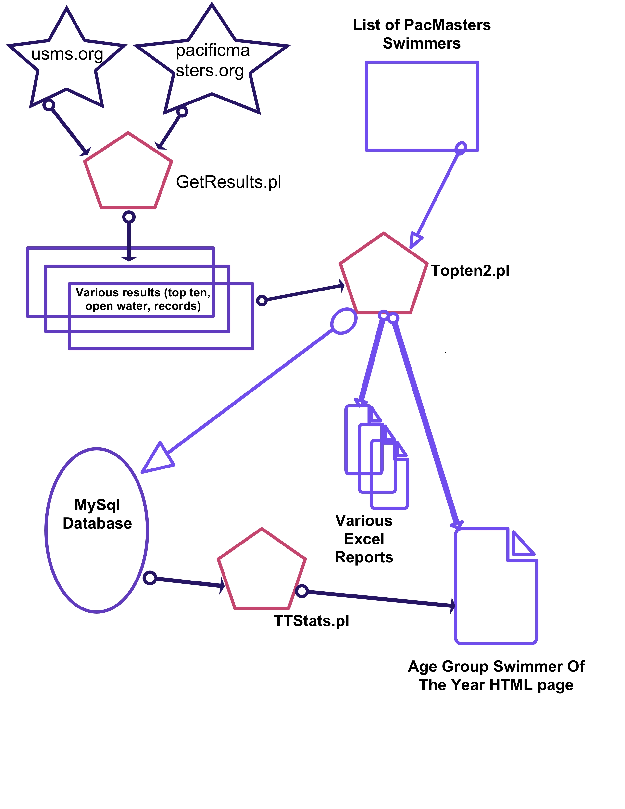

# PMSTopTen Internal Documentation
<h5 style="text-align: center">30May2018 - Bob Upshaw</h5>

TBD:  
1.  In Historical sometimes Support is a link and other times it's a directory.  
2. GeneratedFiles is in Historical but not in the root.  
3. Add a section specifically for GeneratedFiles and link to it in Historical.  
4. Same for SourceData.  
5. Same for SourceData-2018
5. Same for Support  
6. Describe need for RSIDN file.
7. discuss the seasons
8. link to rules in overview
9. change permissions of checked-in properties_DB.txt to be go-rwx
10. 

### Overview
This document contains the details of how to support and run the PMSTopTen project to generate the AGSOTY (Age Group Swimmer Of The Year) page for Pacific Masters (or any other group that wants to do the same thing.)  

This project is comprised of 3 main Perl programs which are used to fetch and process swimmer results for a specific season.  These results are "scraped" from two different web sites:  usms.org and pacificmasters.org.  Both of these web sites are used by their respective organizations to publish the individual swimming results of its members.  It is these results that we analyze to compute the top swimmers in our LMSC.  All swimmers who compete in USMS sanctioned (or approved) events and who earn points (see the AGSOTY rules [[[need link]]]) are included in this analysis and are part of the AGSOTY page.

Here is a high-level view of the data and control flow during the generation of an AGSOTY page.

In order to generate an AGSOTY page you need to fetch the PMSTopTen project files, configure the property files, and then execute the contained programs. 

#### Documentation Conventions
This document will often list steps to perform in the form of Unix shell commands.  A shell command begins with a '%'.  Meta terms are surrounded by <>.  For example:  
% cd \<rootDir\>  
which means "change directory to the directory known as the 'rootDir'".

### Glossary
1.  appRootDir : the root of the tree holding all the files in a local repository tree (e.g. the PMSTopTen project tree.)
2. rootDir : the parent directory of the appRootDir.
3. yearToProcess : the season being processed by the PMSTopTen project.  "year" in the name is a misnomer, since a full season encompasses 18 calendar months. See "What is a Season" below.

###PMSTopTen Project Files
The code and support files for the PMSTopTen project are stored in a GitHub repository here:
[https://github.com/bobup/PMSTopTen](https://github.com/bobup/PMSTopTen)  
In addition, this project uses a shared library of Perl modules stored in this GitHub repository: 
[https://github.com/bobup/PMSPerlModules](https://github.com/bobup/PMSPerlModules)  
General purposes Perl modules are used and are available from CPAN.

To build and use the PMSTopTen project you'll need to create TWO local repositories:  one for PMSTopTen and the other for PMSPerlModules.  Details follow:
#####PMSPerlModules
To create the PMSPerlModules local repository execute the following commands:  
1. `% cd <rootDir>`  
2. `% git clone https://github.com/bobup/PMSPerlModules`

#####Files that make up PMSPerlModules
When you create the local repository for the PMSPerlModules project you'll have a tree with the root being named 'PMSPerlModules' located in your "rootDir".  This is known as the "appRootDir" in the documentation.  Here is what makes up the appRootDir of the PMSPerlModules project when cloned from the GitHub repository:

PMSPerlModules/

* History_MySqlSupport.pm - (Not used by PMSTopTen.  Used by PMSOWPoints only.)
* PMSConstants.pm - Contains some global constants.
* PMSLogging.pm  - Supports logging to files and the console.
* PMSMacros.pm - Macro support for template processing and code.
* PMSProcess2SingleFile.pm - (Not used by PMSTopTen.  Used by PMSOWPoints only.)
* PMSStoreSingleRow.pm - (Not used by PMSTopTen.  Used by PMSOWPoints only.)
* PMSStruct.pm - Contains more complex data structures.
* PMSUtil.pm - Generally purpose utility routines.
* PMS_ImportPMSData.pm - Read various support data files (RSIDN, etc.)
* PMS_MySqlSupport.pm  - MySql support routines.

#####PMSTopTen
To create the PMSTopTen local repository execute the following commands:  
1. `% cd <rootDir>`  
2. `% git clone https://github.com/bobup/PMSTopTen`

#####Files that make up PMSTopTen

When you create the local repository for the PMSTopTen project you'll have a tree with the root being named 'PMSTopTen' located in your "rootDir".  This is known as the "appRootDir" in the documentation.  Here is what makes up the appRootDir of the PMSTopTen project when cloned from the GitHub repository:

PMSTopTen/

* Code/  - Contains Perl code, HTML templates, bash scripts, etc.
 * GetResults.pl  - The program used to fetch the raw data processed by PMSTopTen in order to create the top ten html file (and other output.)
 * Topten2.pl  - The program used to analyze the data files fetched by GetResults.pl and generate the top ten html file (and other output.)
 * TTStats.pl  - The program used to generate some statistics about the top ten analysis performed by Topten2.pl.
 * Scripts/  - useful bash scripts.  Used on both Mac and Linux.
     * DoFetchAndProcessTopten  - Executes GetResults.pl and then, if necessary, Topten2.pl.
     * FetchTopten  - Executes GetResults.pl
     * GenTopten2  - Executes Topten2.pl
     * cmpcsv.sh  - Used to compare two csv files.  Currently only useful on a Mac, where line termination is a problem.

 * TTPerlModules/ - A directory containing Perl libraries used by this project.
     * TT_Logging.pm  - Logging support routines.
     * TT_MySqlSupport.pm  - MySql support routines.
     * TT_SheetSupport.pm  - Excel support routines.
     * TT_Struct.pm  - Data structure support routines.
     * TT_Template.pm  - Template processing support routines.
     * TT_USMSDirectory.pm  - Support caching USMS data.
     * TT_Util.pm  - Various utility support routines.

 * Templates/  - a collection of small HTML files that contain macros and are used by Topten2.pl to create the resultant HTML file.
     * AGSOTY-StartHead.html, etc.  - Various template files used in the generation of the top ten HTML file.
     * Stats/  - Contains a template file used to generate HTML-formatted statistics about the top ten results.
         * TTStatsTemplate.txt  - Statistics template file.

 * properties.txt  - properties that control the above Perl programs and also supply some values for the macros referenced in the templates.
* Historical/  - Contains historical data (data for previous years)
    * 2016/ - Contains all the data necessary to generate the 2016 top ten final results, along with the final generated files.
        * GeneratedFiles/  - Contains the final generated files.  Details below.
        * SourceData/  - Contains the data necessary to create the generated files.  Details below.

    * 2017/ - Same as for 2016/
    * (Other years will be added when completed.)

* LICENSE.txt  - The software license covering this repository.
* README.md  - A brief description of this project.
* SeasonData/  - The data used to generate the top ten page for the current season.
    * Season-2018/  - This assumes that the current season is 2018.  This directory contains all the data used to generate top ten results for this season.
        * PMSSwimmerData/  - PMS swimmer-specific data, independent of results.  For example, RSIDN (aka RSIND) files, the most current of which represents the PMS membership database.
        * SourceData-2018/  - PMS results data which is processed to compute the top ten web page.  Contains files making up PMS top ten results for each course, USMS top ten for each course, records, open water results, etc.  See below for details.
        * properties-2018.txt  - season-specific properties that control the above Perl programs and also supply some values for the macros referenced in the templates.  Properties in this file override properties defined in the properties.txt file described above.
* Support/  - Runtime support files.
* doc/  - The directory holding this document and others.

###Configuration of the Local Repository
Once you've created the local repositories for the PMSPerlModules and the PMSTopTen projects you need to configure the PMSTopTen project.  Here is what needs to be done:

#####Make the GeneratedFiles Directory
We need to make sure the directory into which all generated files are written exists:

1. `% cd <rootDir>/PMSTopTen`  
2. `% mkdir -p GeneratedFiles`

#####Configure the Database
Next you need to configure database access for the PMSTopTen project whose <appRootDir> is <rootDir>/PMSTopTen.  To do this you need to update a property file stored in <appRootDir>/Code named properties_DB.txt:

1. `% cd <appRootDir>/Code`
2. `% vi properties_DB.txt`
    3. Change the value of "dbHost" to be the host name of the server hosting the database server.  This will be "localhost" if the database server is running on the same server running this project.
    4. Set the value of "dbName" to the name of the name database being used by this project.
    5. Set the value of "dbUser" to the name of the database user used by this project.
    6. Set the value of "dbPass" to the to the dbUser's password that gives the user read/write access to all the tables of the dbName database.  Since this should be kept private DO NOT allow this file to be readable to world.  If necessary do this: 
4. `% chmod go-rwx properties_DB.txt`

#####PERL CPAN Libraries
The PMSTopTen project depends on a few public domain Perl libraries in order to support Excel reading and writing.  These are the CPAN libraries that were used during development:

* Excel-Writer-XLSX-0.96/  
* Spreadsheet-Read-0.75/  
* Spreadsheet-XLSX-0.15/

You must guarantee that the Perl search path includes these libraries that you've downloaded and installed on the machine running this project.  The easiest way to do this is to set the environment variable "PERL5LIB" to the list of directories holding the above libraries.  For example:

`% export PERL5LIB=/home/cpan/Excel-Writer-XLSX-0.96/lib\`
 
`    :/home/cpan/Spreadsheet-Read-0.75\`
 
`    :/home/cpan/Spreadsheet-XLSX-0.15/lib`

Note that later versions may be available and should probably work just as well as the versions above.

###Run the PMSTopTen Project
Once we have the GeneratedFiles/ subdirectory and we've configured our database access we can fetch race results, analyze them, and generate the AGSOTY page.  To do that follow these steps:

1. `% cd <appRootDir>/Code/Scripts`
2. `% ./FetchTopten <yearToProcess>`
3. `# assuming the above did not get any errors we can now generate our AGSOTY page`
4. `% ./GenTopten2 <yearToProcess>`

At this point the generated AGSOTY page, Excel files, and log files have been written to <appRootDir>/GeneratedFiles/ .

##What is a Season
